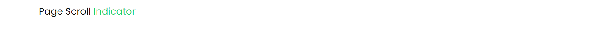
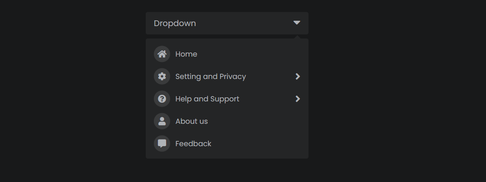

# Frontend Components

Collection of small components used on websites.

- [x] Page Scroll Indicator
- [x] Dropdown
- [x] File Upload UI
- [x] Scroll to Top

### Task List

- [ ] Continue to Build on Components

<h1 align="center">

 
</h1>
